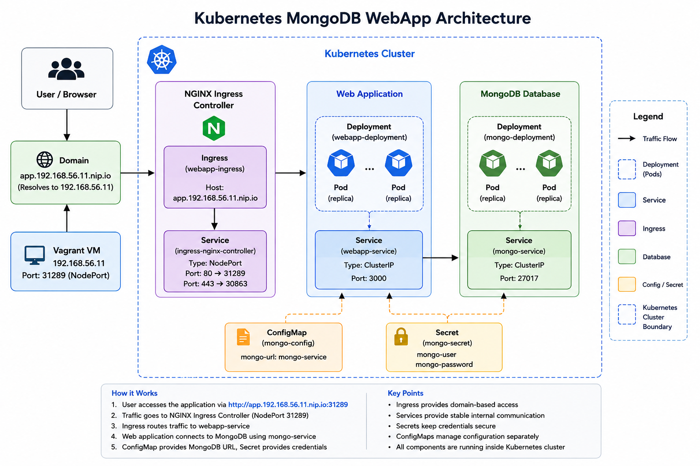
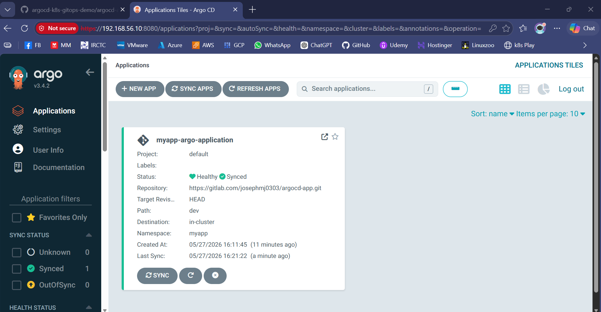
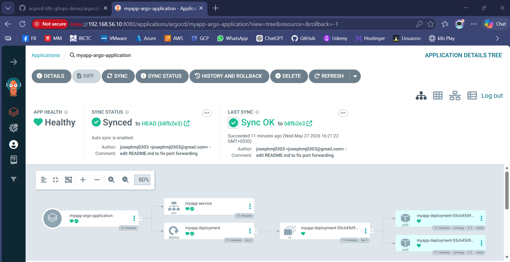
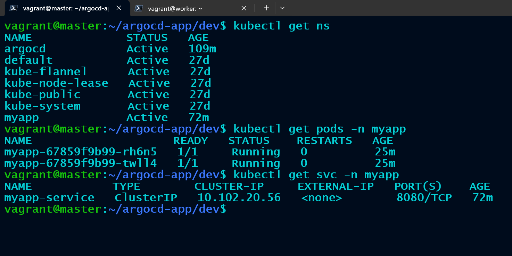

# ArgoCD Kubernetes GitOps Demo


A simple GitOps-based Kubernetes deployment demo using ArgoCD and GitLab.

---

## 📌 Project Overview

This project demonstrates how to deploy and manage applications in Kubernetes using GitOps principles with ArgoCD.

The Kubernetes manifests are stored in a GitLab repository, and ArgoCD continuously watches the repository for changes. Any updates pushed to GitLab are automatically synchronized with the Kubernetes cluster.

---

## 🧠 Features

- GitOps workflow using ArgoCD
- Kubernetes Deployment and Service manifests
- Automated synchronization
- Self-healing deployments
- Automatic namespace creation
- GitLab repository integration
- Simple and beginner-friendly project structure

---

## ⚙️ Tech Stack

- Kubernetes
- ArgoCD
- GitLab
- Docker
- Vagrant
- Ubuntu Linux

---

## 📂 Repository Structure

```bash
argocd-app/
│
├── architecture
│    └── architecture-diagram.png
│
├── screenshots
│    ├── argocd-ui.png
│    ├── app-status.png
│    └── pod-status.png
│
├── docs/
│    ├── architecture.md
│    ├── argocd-setup.md
│    ├── gitlab-integration.md
│    ├── deployment-guide.md
│    ├── troubleshooting.md
│    └── gitops-workflow.md
│
├── README.md
│
├── application.yaml
│
└── dev/
    ├── deployment.yaml
    └── service.yaml
```

---

## 🚀 Architecture 


---

## 📊 Prerequisites

Before starting, ensure the following are installed:

- Kubernetes Cluster
- kubectl
- ArgoCD
- Git
- Vagrant
- VirtualBox

---

## 🧪 Installing ArgoCD

#### Create namespace:

```bash
kubectl create namespace argocd
```

#### Install ArgoCD:

```bash
kubectl apply -n argocd -f https://raw.githubusercontent.com/argoproj/argo-cd/stable/manifests/install.yaml
```

#### Verify installation:

```bash
kubectl get pods -n argocd
```

---

## 📦 Accessing ArgoCD UI

Since this project uses Vagrant VMs, expose the ArgoCD server using:

```bash
kubectl port-forward --address 0.0.0.0 svc/argocd-server 8080:443 -n argocd
```

Then access:

```text
https://<VM-IP>:8080
```

Example:

```text
https://192.168.56.11:8080
```

---

## 🖥️ Getting ArgoCD Admin Password

```bash
kubectl get secret argocd-initial-admin-secret -n argocd \
-o jsonpath="{.data.password}" | base64 -d
```

Username:

```text
admin
```

---

## 🔄 Connecting GitLab Repository to ArgoCD

Since the repository is private, add GitLab credentials to ArgoCD.

### Create GitLab Personal Access Token

Required permission:

```text
read_repository
```

---

### Add Repository Using CLI

```bash
argocd repo add https://gitlab.com/josephmj0303/argocd-app.git \
  --username YOUR_GITLAB_USERNAME \
  --password YOUR_GITLAB_TOKEN
```

---

### Add Repository Using ArgoCD UI

- Settings
- Repositories
- Connect Repo

Use:

| Field | Value |
|------|------|
| Type | git |
| Repository URL | https://gitlab.com/josephmj0303/argocd-app.git |
| Username | GitLab Username |
| Password | GitLab Personal Access Token |

---

## 🔄 Deploying the Application

Apply the ArgoCD application:

```bash
kubectl apply -f application.yaml
```

Verify deployment:

```bash
kubectl get applications -n argocd
```

Check pods:

```bash
kubectl get pods -n myapp
```

Check service:

```bash
kubectl get svc -n myapp
```

---

## 🧪 GitOps Workflow

1. Developer pushes code/manifests to GitLab
2. ArgoCD detects repository changes
3. ArgoCD synchronizes manifests
4. Kubernetes updates resources automatically
5. Application state remains synchronized with Git

---

## 🔄 ArgoCD Sync Features

This project uses:

```yaml
automated:
  selfHeal: true
  prune: true
```

### selfHeal

Automatically restores deleted or modified Kubernetes resources.

### prune

Removes Kubernetes resources deleted from Git.

---

## 🎯 Useful Commands

### Check application status

```bash
argocd app get myapp-argo-application
```

### Force sync

```bash
argocd app sync myapp-argo-application
```

### Refresh application

```bash
argocd app refresh myapp-argo-application --hard
```

### View cluster resources

```bash
kubectl get all -n myapp
```

---

## 📸 Screenshots

#### Argocd Console


#### Application Status


#### Pods Running


---

## 📈 Future Improvements

- Add Ingress Controller
- Add TLS Certificates
- Add Helm Charts
- Add Horizontal Pod Autoscaler
- Add Multi-Environment Setup
- Add CI/CD Validation Pipeline
- Add Monitoring with Prometheus & Grafana
- Add ArgoCD Notifications
- Add Kustomize Support
- Add Resource Limits and Requests

---

## 🧠 Learning Objectives

This project helps understand:

- GitOps concepts
- ArgoCD workflow
- Kubernetes deployments
- Kubernetes services
- Continuous deployment
- Infrastructure automation

---

## 🏁 License

This project is licensed under the MIT License.

---

## 👨‍💻 Author

Joseph M J

DevOps Engineer


